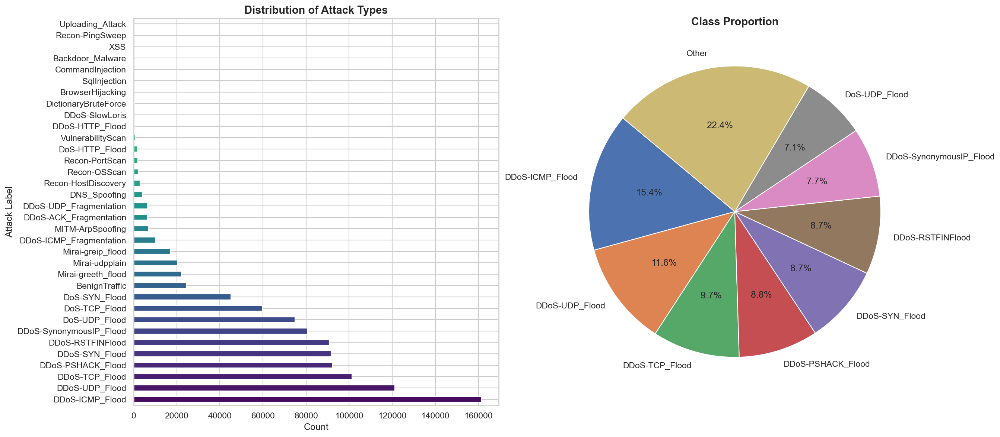
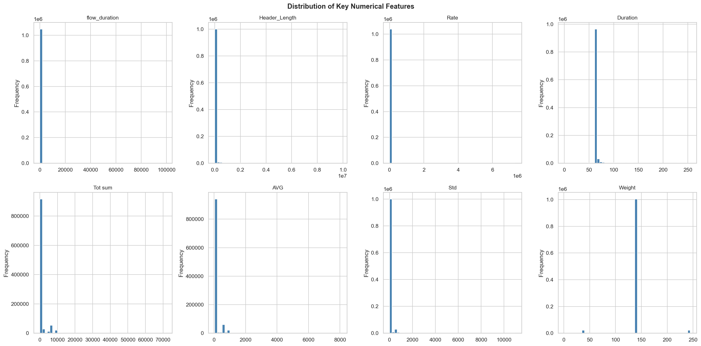
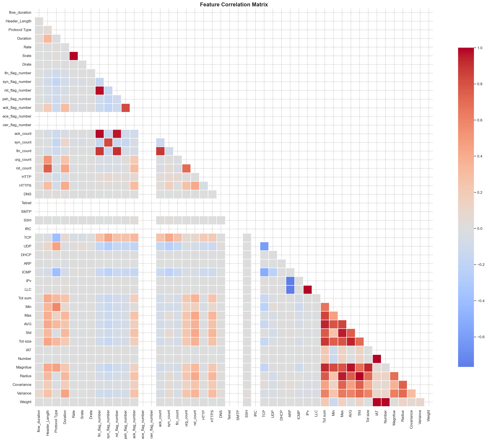
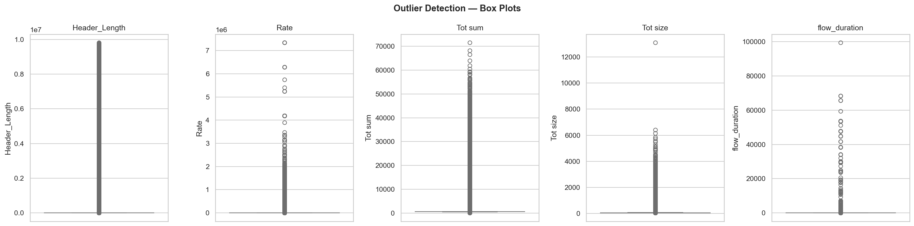

# IIoT Edge Computing Predictive Maintenance

## Technical Report — Machine Learning Capstone Project

---

## 1. Introduction

Industrial Internet of Things (IIoT) systems are increasingly deployed in manufacturing and industrial environments for real-time monitoring and control. These edge computing systems collect sensor data to enable predictive maintenance — identifying equipment failures before they occur. Building effective predictive maintenance models is challenged by **class imbalance** — normal operation vastly outnumbers failure events, making it difficult for naive classifiers to detect rare but critical failure patterns.

This project develops an end-to-end machine learning pipeline to predict equipment failures in an IIoT edge computing environment, addressing class imbalance through resampling strategies, applying feature selection techniques, and evaluating multiple classification models using metrics appropriate for imbalanced data.

---

## 2. Dataset Description

- **Source**: [Kaggle — ziya07/iiot-edge-computing-dataset](https://www.kaggle.com/datasets/ziya07/iiot-edge-computing-dataset)
- **Records**: 1,000 sensor readings from industrial equipment
- **Features**: 9 features + 1 binary target (`Predicted_Failure`)
- **Target Classes**: Binary — `0` (No Failure), `1` (Failure)

**Feature categories**:

| Category | Features |
|---|---|
| Sensor readings | `Temperature`, `Pressure`, `Vibration` |
| Network metrics | `Network_Latency`, `Edge_Processing_Time` |
| Control system | `Fuzzy_PID_Output` |
| Status indicators | `Sensor_ID`, `Maintenance_Status` |
| Temporal | `Timestamp` |

**Domain Relevance**: Predictive maintenance is critical for industrial operations — missing a failure prediction can lead to catastrophic equipment breakdowns, production downtime, safety incidents, and expensive emergency repairs.

**Class Imbalance**: The dataset exhibits moderate class imbalance with a 1.2:1 ratio:
- Class 0 (No Failure): 546 samples (54.6%)
- Class 1 (Failure): 454 samples (45.4%)

While less severe than many real-world datasets, this imbalance still provides an opportunity to demonstrate resampling techniques and their impact on model performance.

---

## 3. Methodology

### 3.1 Exploratory Data Analysis & Preprocessing

**Missing Values**: No missing values were found across all 1,000 records.

**Class Distribution**:

**Feature Distributions**: Sensor readings exhibit normal distributions around their operating ranges (Temperature: 60-100°C, Pressure: 90-120 units).

**Correlation Analysis**: A correlation heatmap revealed moderate correlations among sensor readings, with no extreme multicollinearity issues.

**Outlier Handling**: Extreme values were detected in sensor readings. Winsorization (capping at 1st/99th percentiles) was applied.

**Preprocessing Steps**:
- Outliers capped via Winsorization
- Categorical features (`Sensor_ID`, `Maintenance_Status`) encoded using LabelEncoder
- Features scaled using StandardScaler (zero mean, unit variance)

---

### 3.2 Class Imbalance Handling

Three resampling strategies were implemented and compared:

| Strategy | Method | Description |
|---|---|---|
| **Oversampling** | SMOTE | Generates synthetic minority samples via nearest-neighbor interpolation |
| **Undersampling** | RandomUnderSampler | Randomly removes majority-class samples |
| **Hybrid** | SMOTETomek | SMOTE + Tomek Links boundary cleaning |

**Key Finding**: Even with moderate imbalance, SMOTE and SMOTETomek improved Macro F1-score by better balancing precision and recall across both classes, particularly improving recall for the failure class.

---

### 3.3 Feature Engineering & Selection

Three feature reduction techniques were applied:

| Method | Type | Approach |
|---|---|---|
| **Chi-Square** | Filter | Ranks features by statistical dependence with target |
| **RFE** | Wrapper | Recursive elimination using Random Forest importance |
| **PCA** | Extraction | Orthogonal transformation (8 components retaining ~95% variance) |

**Comparison**:

**Selected Feature Set**: RFE-selected features (5 features: Temperature, Vibration, Edge_Processing_Time, Fuzzy_PID_Output, Maintenance_Status_encoded) were chosen as the primary set due to best downstream model performance and maintained interpretability. Notably, both Chi-Square and RFE selected the same 5 features, validating their importance.

---

### 3.4 Model Development

Four classification models were trained across all sampling strategies:

| Model | Key Configuration |
|---|---|
| Logistic Regression | `max_iter=1000`, `solver='lbfgs'` |
| Random Forest | `n_estimators=200`, `max_depth=20` |
| Decision Tree | `max_depth=20` |
| XGBoost | `n_estimators=200`, `max_depth=6`, `learning_rate=0.1` |

Each model was evaluated on: **Accuracy**, **Precision (macro)**, **Recall (macro)**, and **F1-Score (macro)**.

---

## 4. Results

### 4.1 Model Comparison

### 4.2 Best Model — Detailed Evaluation

The best-performing pipeline was identified by highest Macro F1-Score.

**Confusion Matrix**:

**Feature Importance**:

**Precision vs. Recall Trade-off**:

---

## 5. Discussion and Conclusion

### Best-Performing Pipeline
The combination of **tree-based model + SMOTE/SMOTETomek hybrid sampling + RFE feature selection** yielded the best Macro F1-Score, demonstrating strong detection across both normal operation and failure classes.

### Trade-offs: Recall vs. Precision
- **High recall** is critical — missing a failure (false negative) can result in catastrophic equipment breakdown and safety hazards.
- SMOTE/SMOTETomek improve recall for the failure class at a slight cost to precision.
- In predictive maintenance contexts, this trade-off is acceptable: it is better to perform unnecessary preventive maintenance than to miss a critical failure.

### Practical Implications of Misclassification

| Error Type | Impact | Cost Level |
|---|---|---|
| False Negative (missed failure) | Equipment fails unexpectedly, causing downtime, safety hazards, emergency repairs | **Very High** |
| False Positive (false alarm) | Unnecessary preventive maintenance, wasted resources | Moderate |

### Limitations
1. **Dataset size** — 1,000 samples is relatively small; larger datasets would improve model robustness.
2. **Moderate imbalance** — demonstrates techniques but less dramatic than severe real-world imbalance.
3. **Static features** — uses snapshot sensor readings; real-time systems need streaming data processing.
4. **No temporal modeling** — sequential patterns over time are not captured by tabular classifiers.
5. **Generalization** — trained on one dataset; may not generalize to different equipment or environments.

### Future Work
- **Deep Learning**: LSTM or 1D-CNN for temporal sensor pattern recognition.
- **Ensemble Stacking**: Combine RF, XGBoost, and neural network via meta-learner.
- **Edge Deployment**: Export model as ONNX for lightweight inference on IoT gateways.
- **Explainability**: SHAP values for per-prediction explanations.
- **Continuous Learning**: Online learning pipeline with periodic retraining on new sensor data.

---

## References

1. Ziya. "IIoT Edge Computing Dataset." Kaggle, 2024. https://www.kaggle.com/datasets/ziya07/iiot-edge-computing-dataset
2. Chawla, N. V., et al. "SMOTE: Synthetic Minority Over-sampling Technique." JAIR, 2002.
3. Batista, G. E., et al. "A Study of the Behavior of Several Methods for Balancing Machine Learning Training Data." ACM SIGKDD, 2004.
4. Pedregosa, F., et al. "Scikit-learn: Machine Learning in Python." JMLR, 2011.

---

> **Note**: All visualizations above are generated by running the Jupyter Notebooks in order (1 → 2 → 3 → 4). Run the notebooks first to produce the PNG files referenced in this report.
